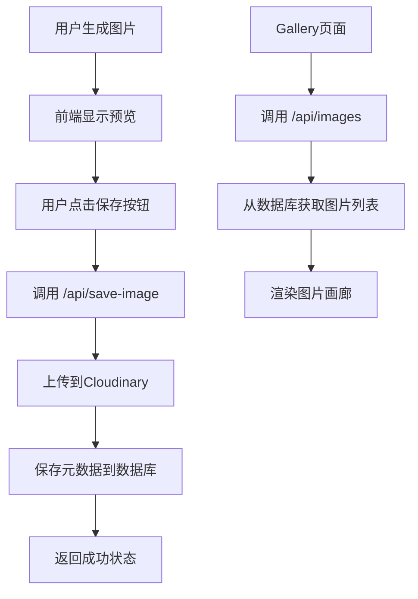

# Cloudinary集成设置指南

## 概述

本项目使用Cloudinary云存储服务来管理和展示用户生成的AI猫咪图片。用户生成图片后可以选择保存到云端画廊，其他用户可以在Gallery页面浏览所有保存的图片。

## 功能特性

- ✅ **选择性保存**: 用户生成图片后可选择是否保存到云端
- ✅ **图片优化**: 自动压缩和格式优化
- ✅ **分页展示**: 支持分页浏览所有图片
- ✅ **下载分享**: 支持图片下载和分享功能
- ✅ **提示词保存**: 保存生成图片的提示词
- ✅ **响应式设计**: 适配各种设备尺寸

## 环境配置

### 1. 注册Cloudinary账户

1. 访问 [Cloudinary官网](https://cloudinary.com/)
2. 注册免费账户（每月10GB免费存储和带宽）
3. 获取以下配置信息：
   - Cloud Name
   - API Key
   - API Secret

### 2. 配置环境变量

在项目根目录的 `.env.local` 文件中添加：

```env
# Cloudinary Configuration
CLOUDINARY_CLOUD_NAME=your_cloud_name
CLOUDINARY_API_KEY=your_api_key
CLOUDINARY_API_SECRET=your_api_secret
```

### 3. 创建数据库表

运行以下SQL脚本创建图片存储表：

```bash
# 如果使用Supabase
npx supabase sql create-images-table.sql

# 或者直接在数据库中执行 create-images-table.sql 文件
```

## 架构说明

### API端点

1. **`/api/save-image`** (POST)
   - 保存base64图片到Cloudinary
   - 存储图片元数据到数据库
   - 返回保存结果

2. **`/api/images`** (GET)
   - 获取图片列表（支持分页）
   - 支持用户过滤
   - 返回图片数据和分页信息

### 数据流程



### 文件结构

```
├── lib/cloudinary.ts              # Cloudinary工具函数
├── app/api/save-image/route.ts    # 保存图片API
├── app/api/images/route.ts        # 获取图片列表API
├── components/share/Gallery.tsx   # 图片展示组件
├── components/quiz/CatQuiz.tsx    # 测试组件（含保存功能）
└── create-images-table.sql        # 数据库表创建脚本
```

## 使用说明

### 用户保存图片

1. 用户完成测试生成图片
2. 图片立即显示在前端
3. 用户点击"保存到画廊"按钮
4. 系统上传图片到Cloudinary并保存元数据
5. 显示保存成功状态

### 浏览图片画廊

1. 访问Gallery页面
2. 系统自动加载最新的图片
3. 支持分页浏览更多图片
4. 可以下载和分享图片
5. 鼠标悬停显示提示词

## 性能优化

### Cloudinary优化

- **自动格式**: 根据浏览器自动选择最佳格式（WebP、AVIF等）
- **自动质量**: 智能压缩保持视觉质量
- **尺寸统一**: 自动裁剪为512x512像素
- **CDN加速**: 全球CDN加速图片加载

### 前端优化

- **图片懒加载**: 使用Next.js Image组件
- **错误处理**: 图片加载失败时显示占位符
- **分页加载**: 避免一次性加载过多图片
- **缓存策略**: 充分利用浏览器缓存

## 错误处理

### 常见问题

1. **图片上传失败**
   - 检查网络连接
   - 验证Cloudinary配置
   - 检查图片大小限制

2. **图片加载失败**
   - 自动回退到占位符
   - 提供重试机制
   - 显示友好错误信息

3. **分页问题**
   - 处理空数据状态
   - 边界条件检查
   - 加载状态提示

## 费用说明

### Cloudinary免费计划

- **存储**: 10GB
- **带宽**: 每月10GB
- **变换**: 25,000次/月
- **请求**: 25,000次/月

### 预估用量

- 每张图片约 **200KB** (优化后)
- 免费计划可存储约 **50,000** 张图片
- 适合中等规模应用使用

## 扩展功能

### 计划中的功能

- [ ] 用户个人画廊
- [ ] 图片点赞和评论
- [ ] 图片搜索和过滤
- [ ] 批量下载功能
- [ ] 图片删除管理
- [ ] 高级分享选项

### 可选优化

- [ ] Redis缓存图片列表
- [ ] 图片缩略图生成
- [ ] 水印添加
- [ ] 图片审核机制

## 技术支持

如果遇到问题，请检查：

1. 环境变量配置是否正确
2. 数据库表是否已创建
3. Cloudinary账户额度是否充足
4. 网络连接是否正常

更多信息请参考：
- [Cloudinary官方文档](https://cloudinary.com/documentation)
- [Next.js Image组件](https://nextjs.org/docs/api-reference/next/image) 